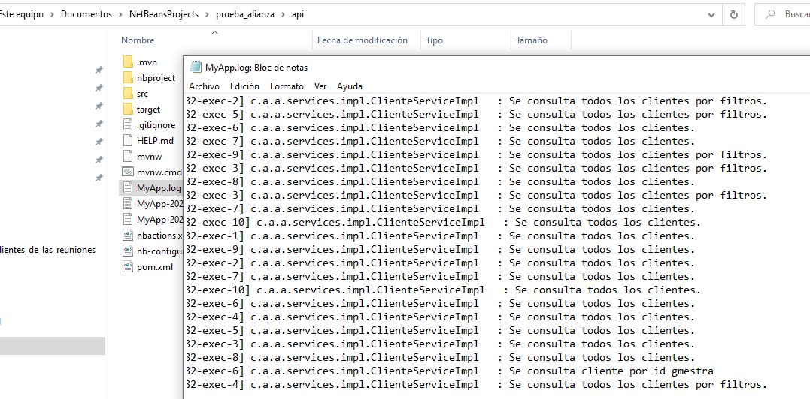

# Prueba técnica alianza

## Herramientas usadas

<table>
  <tr>
    <td><b>Herramienta</b></td>
    <td><b>Versión</b></td>
  </tr>
  <tr>
    <td colspan="2"><b>Backend (api)</b></td>
  </tr>
  <tr>
    <td>Maven</td>
    <td>3.6.0</td>
  </tr>
  <tr>
    <td>Java</td>
    <td>11</td>
  </tr>
  <tr>
    <td>Spring boot</td>
    <td>2.4.2</td>
  </tr>
  <tr>
    <td>Database</td>
    <td>H2</td>
  </tr>
  <tr>
    <td>JUnit</td>
    <td>5</td>
  </tr>
 <tr>
    <td colspan="2"><b>Frontend (cliente)</b></td>
  </tr>
  <tr>
    <td>Angular</td>
    <td>9</td>
  </tr>
  
</table>

## Persintencia

Para la persitencia se usa una base de datos H2 que se crear en memoria al iniciar la aplicación, los datos persisten mientras se ejecute la aplicación
al terminar los datos se pierden, tiene una data precargada que se configura en el archivo resources/data.sql 

## Ejecución

- Abrir el proyecto api y compilarlo con el comando <code>mvn clean install</code> y luego ejecutar <code>mvn spring-boot:run</code> para levantar los servicios del api rest.

- Abrir el proyecto cliente y ejecutar el comando <code>npm install</code> para instalar los modulos que requiere el proyecto, al finalizar ejecurar el comando <code>ng serve -o</code> 

- Archivo log

- Para ingresar a la bd H2 `http://localhost:8082/api/v1/h2-console` no tiene contraseña

- Para ver la documentación de los servicios ingrese en `http://localhost:8082/api/v1/swagger-ui/#`

## Capturas 

